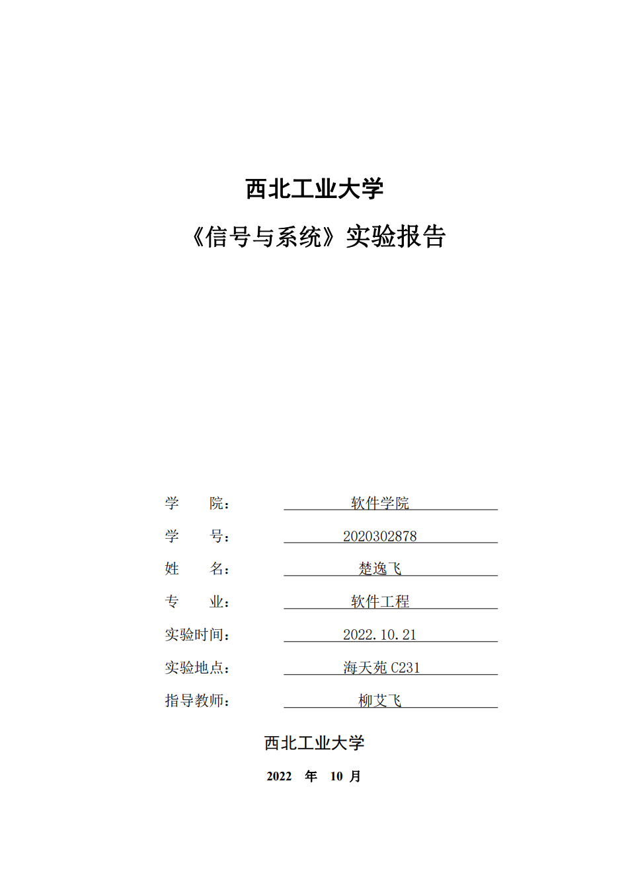


# 一、实验目的
#### 1.	掌握信号的表示及其可视化方法。
#### 2.	掌握信号基本时域运算的实现方法。
#### 3.	实现线性时不变LTI系统的全响应求解，并把基于仿真平台内置函数的仿真结果与理论计算结果进行比较。
#### 4.	实现周期信号的傅里叶级数展开。


# 二、实验报告要求
#### 1.	提交：实验报告一份，PDF格式，其他格式拒收。
#### 实验报告中需要包括：
a)	若题目要求理论结果，报告中需要给出理论结果。
b)	结果图；图中需要有适当的标识、横坐标、纵坐标等。
c)	源代码。源代码中要有合适的注释。
d)	实验体会和感悟。
#### 2.	提交实验报告规则：
e)	2022年10月28日12am之前将实验报告发到助教邮箱。
（第一课堂交给施锐，邮箱： 296206140@qq.com;
第二课堂曹歌，邮箱：1765578099 @qq.com）
#### 文件名命名规则：课堂号-学号-姓名-第几次实验。（比如第2课堂的学生，姓名：李三，学号为2019050，第2次实验，文件名命名为：2-2019050-李三-2）


# 三、实验设备（环境）

#### 实验环境：Windows 11 + Python 3.9 
#### 使用vscode编辑测试代码 使用Typora编写markdown文档

# 四、实验内容与实验结果

```python
# 实验中要用到的库
import numpy as np
import matplotlib.pyplot as plt
import scipy.signal as sgn
```

## 1.绘制下列连续时间信号的波形

### 1) $x(t)=sin(2\pi t)[ε(t)-ε(t-3)]$

```python
#导入numpy和matplotlib的pyplot包。
import numpy as np
import matplotlib.pyplot as plt

def ex1_1():
    # 声明时间的范围和step
    t = np.arange(-1, 5, 0.01)

    # 使用封装在numpy中的heaviside作为阶跃函数
    func_x = np.sin(2 * np.pi * t) * (np.heaviside(t, 1) - np.heaviside(t - 3, 1))
    plt.plot(t, func_x)
    # 标记横纵轴名称以及图像名称
    plt.xlabel("t[s]")
    plt.ylabel("x(t)")
    plt.title("Figure 1.1: x(t)")
    plt.show()

ex1_1()
```

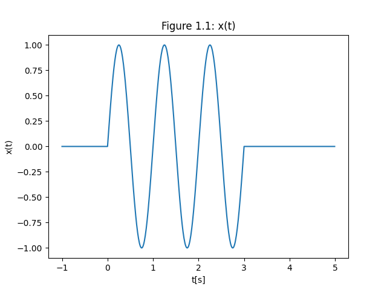

### 2) $h(t)=e^{-t}ε(t)-e^{-2t}ε(t)$

```python
import numpy as np
import matplotlib.pyplot as plt

def ex1_2():
    # 声明时间的范围和step
    t = np.arange(-10, 10, 0.01)
    func_h = np.exp(-t) * np.heaviside(t, 1) - np.exp(-2 * t) * np.heaviside(t, 1)
    plt.plot(t, func_h)
    # 标记横纵轴名称以及图像名称
    plt.xlabel("t[s]")
    plt.ylabel("h(t)")
    plt.title("Figure 1.2: h(t)")
    plt.show()

ex1_2()
```

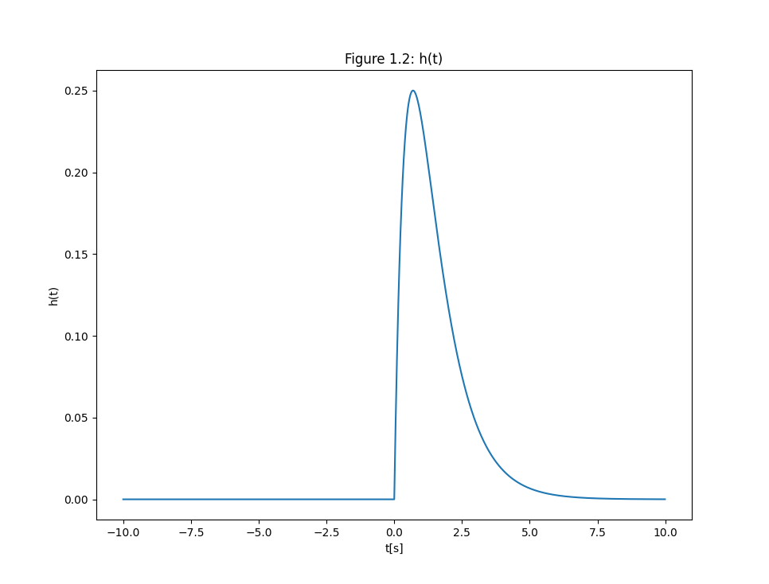

### 3）画出门函数$y(t)=2G_2(t)$，宽度为2，横坐标中心为0，幅度为2

```python
import numpy as np
import matplotlib.pyplot as plt

def ex1_3():
    # 声明时间的范围和step
    t = np.arange(-4, 4, 0.01)
    func_G1 = np.heaviside(t + 1, 1)  - np.heaviside(t - 1, 1)
    func_y = 2 * func_G1
    plt.plot(t, func_y)
    # 标记横纵轴名称以及图像名称
    plt.xlabel("t[s]")
    plt.ylabel("h(t)")
    plt.title("Figure 1.2: h(t)")
    plt.show()

ex1_3()
```

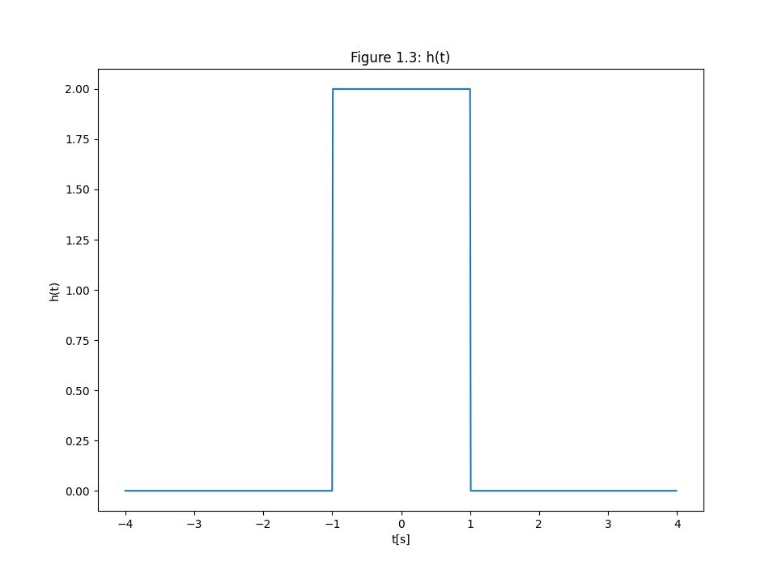

## 2.验证信号的基本运算

### 1） 以单位门函数$y(t)=2G_2(t)$为例，画出$y(2t)$、$y(t/2)$、$y(2-2t)$

```python
import numpy as np
import matplotlib.pyplot as plt

def ex2_1():
    # 声明时间的范围和step
    t = np.arange(-2, 2, 0.01)
    # G_2
    func_G = np.heaviside(t + 0.5, 1)  - np.heaviside(t - 0.5, 1)
    # y(2t)
    func_y1 = np.heaviside(2 * t + 0.5, 1)  - np.heaviside(2 * t - 0.5, 1)
    # y(t/2)
    func_y2 = np.heaviside(t / 2 + 0.5, 1)  - np.heaviside(t / 2 - 0.5, 1)
    # y(2-2t)
    func_y3 = np.heaviside((1 - 2 * t) + 0.5, 1)  - np.heaviside((1 - 2 * t) - 0.5, 1)

    plt.subplot(3, 1, 1)
    plt.plot(t, func_G)
    plt.plot(t, func_y1, color = 'red')
    # 标记横纵轴名称以及图像名称
    plt.xlabel("t[s]")
    plt.ylabel("y(t)")
    plt.legend(['y(t)','y(2t)'])
    plt.title("Figure2.1: y(t) y(2t) y(t/2) y(1-2t)")

    plt.subplot(3, 1, 2)
    plt.plot(t, func_G)
    plt.plot(t, func_y2, color = 'red')
    # 标记横纵轴名称
    plt.xlabel("t[s]")
    plt.ylabel("y(t)")
    plt.legend(['y(t)','y(t/2)'])

    plt.subplot(3, 1, 3)
    plt.plot(t, func_G)
    plt.plot(t, func_y3, color = 'red')
    # 标记横纵轴名称
    plt.xlabel("t[s]")
    plt.ylabel("y(t)")
    plt.legend(['y(t)','y(1-2t)'])

    plt.show()

ex2_1()
```

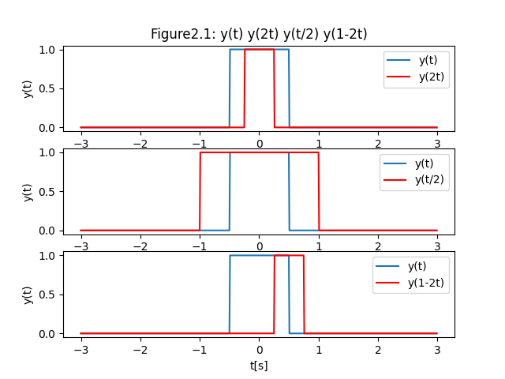

### 2) 画出$\cos(t)+\cos(\frac{\pi}{4}t)$，观察周期

```python
import numpy as np
import matplotlib.pyplot as plt

def ex2_2():
    # 声明时间的范围和step
    t = np.arange(-100, 100, 0.01)
    func_y = np.cos(t) + np.cos(np.pi * t / 4)
    plt.plot(t, func_y)
    # 标记横纵轴名称以及图像名称
    plt.xlabel("t[s]")
    plt.ylabel("y(t)")
    plt.title("Figure2.2: y(t) = cos(t) + cos(pi * t / 4)")
    plt.grid()
    plt.plot()
    plt.show()

ex2_2()
```

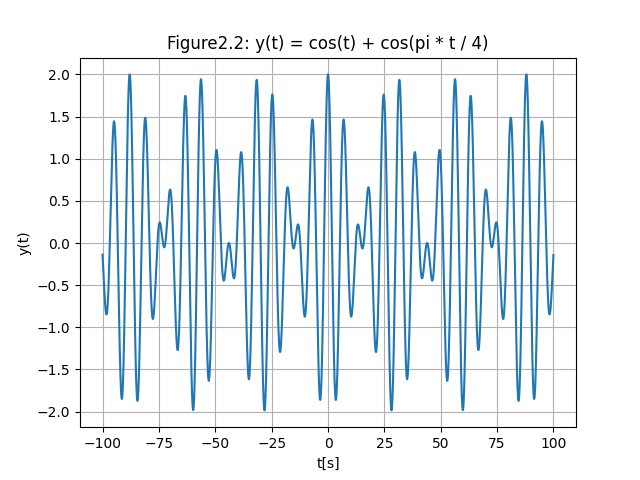

观察图像知：无周期

### 3） 画出$\cos(\pi t)+\cos(2\pi t)$，观察周期

```python

import numpy as np
import matplotlib.pyplot as plt

def ex2_3():
    # 声明时间的范围和step
    t = np.arange(-6, 6, 0.01)
    func_y = np.cos(np.pi * t) + np.cos(2 * np.pi * t)
    plt.plot(t, func_y)
    # 标记横纵轴名称以及图像名称
    plt.xlabel("t[s]")
    plt.ylabel("y(t)")
    plt.title("Figure2.3: y(t) = cos(pi * t) + cos(2 * pi *t)")
    plt.grid()
    plt.show()

ex2_3()
```

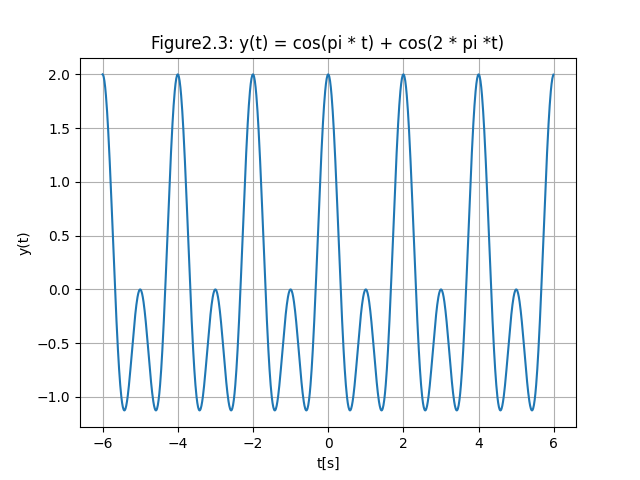

周期为2。

## 3.卷积运算

已知$x(t)=[e^{-2t}ε(t)]*[e^{-3t}ε(t)]$

### 1） 根据卷积定义，推导得到$x(t)$的理论值

$$
x(t)=[e^{-2t}ε(t)]*[e^{-3t}ε(t)]
=\int^{\infty}_{-\infty}e^{-2\tau}ε(\tau) \cdot e^{3\tau-3t}ε(t-\tau)\ {\rm d}\tau 
=\int^t_0e^{-3t+\tau}\rm\ d\tau
=(e^{-2t}-e^{-3t})ε(t)
$$

### 2） 计算仿真值

```python
import numpy as np
import matplotlib.pyplot as plt

def ex3_2():
    # 声明时间的范围和step
    t = np.arange(0, 5, 0.01)
    func_y1 = np.exp(-2 * t) * np.heaviside(t, 0)
    func_y2 = np.exp(-3 * t) * np.heaviside(t, 0)
    func_y = sgn.convolve(func_y1, func_y2) * 0.01

    # 仿真值
    plt.subplot(3, 1, 1)
    plt.plot(np.arange(0, 9.99, 0.01), func_y, label = "simulate")
    plt.xlabel("t[s]")
    plt.ylabel("y(t)")
    plt.legend()
    plt.title("Figure3.2: Convolution")
   
    t_theory = np.arange(0, 10, 0.01)
    y_theory = (np.exp(-2 * t_theory) - np.exp(-3 * t_theory)) * np.heaviside(t_theory, 0)

    # 理论值
    plt.subplot(3, 1, 2)
    plt.plot(t_theory, y_theory, color = 'red',label = "theory")
    plt.xlabel("t[s]")
    plt.ylabel("y(t)")
    plt.legend()

    # 二者对比
    plt.subplot(3, 1, 3)
    plt.plot(np.arange(0, 9.99, 0.01), func_y)
    plt.plot(t_theory, y_theory, color = 'red')
    plt.ylabel("y(t)")
    plt.xlabel("t[s]")
    plt.legend

    plt.show()

ex3_2()

```

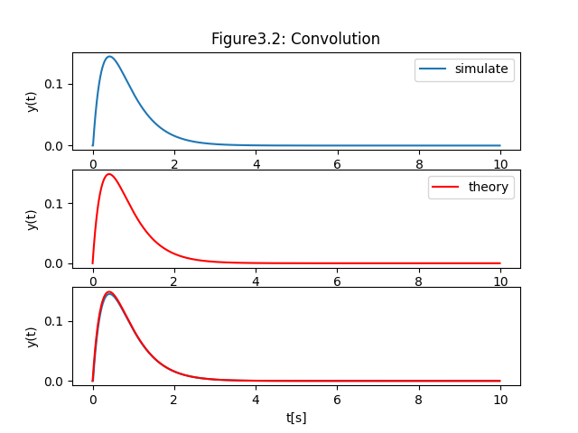

### 3） 对比理论数值

由图3.2可知，python仿真值与理论值基本一致。

## 4.求解系统的零状态响应

设有一个线性时不变系统，微分方程为$r''(t)+3r'(t)+2r(t)=e(t)$,其中$e(t)$为输入信号，$r(t)$为系统输出，$e(t)=e^{-2t}ε(t)$.

### 1) 根据理论推导获得零状态响应$r_{ZS}(t)$

设$r(t)=e^{\lambda t}$,代入$r''(t)+3r'(t)+2r(t)=0$,解得$\lambda =-1$或$\lambda = -2$。

冲激函数$h(t)=(e^{-t}-e^{-2t})\varepsilon(t)$.

得到零状态响应：

$$
\begin{align}
r_{ZS}
&= e^{-2t}\varepsilon(t)*(e^{-t}-e^{-2t})\varepsilon(t)\\[2ex]
&=\int_{-\infin}^{+\infin}e^{-2\tau}\varepsilon(\tau)\cdot (e^{-(t-\tau)}-e^{-2(t-\tau)})\varepsilon(t-\tau){\rm d}\tau\\[2ex]
&=\int_{0}^te^{-2\tau}\cdot(e^{-t+\tau} - e^{-2t+2\tau}){\rm d}\tau\\[2ex]
&=\int_0^t e^{-t-\tau}-e^{-2t}{\rm d}\tau\\[2ex]
&= \left. -e^{-t-\tau}-e^{-2t}\tau \right|_0^t\\[2ex]
&= e^{-t}-(1+t)e^{-2t}
\end{align}
$$

### 2） 仿真计算


```python
import numpy as np
import matplotlib.pyplot as plt
import scipy.signal as sgn

def ex4_2():
    # 线性时不变系统
    system = sgn.lti([1], [1, 3, 2])

    # 声明时间的范围和step
    t = np.arange(0, 10, 0.01)

    # 零状态相应
    func = np.exp(-2 * t) * np.heaviside(t, 0)
    theory = np.exp(-1 * t) - (1 + t) * np.exp(-2 * t)

    # 理论值
    plt.subplot(3 ,1 , 1)
    plt.plot(t, theory)
    plt.ylabel("r_ZS")
    plt.title("Figure 4: Zero-State Response")

    tout, yout, xout = sgn.lsim(system, func, t)

    # 仿真值
    plt.subplot(3, 1, 2)
    plt.plot(tout, yout, color = "red", label = "simulate")
    plt.xlabel("t[s]")
    plt.ylabel("r_ZS")

    # 二者对比
    plt.subplot(3, 1, 3)
    plt.plot(t, theory, label = "theory")
    plt.plot(tout, yout, color = "red", label = "simulate")
    plt.xlabel("t[s]")
    plt.ylabel("r_ZS")
    plt.legend()
    plt.show()

ex4_2()
```

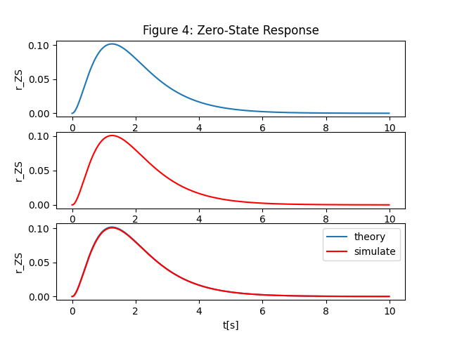

### 3） 比较差异

二者差异很小，基本一致

## 5.周期信号的傅里叶级数展开

定义一个周期信号$f(t)$为矩形脉冲序列，如图所示，设定$E=2$,$\tau =1$,$T=2$.


```python
import numpy as np
import matplotlib.pyplot as plt

def ex5_1():
    t = np.linspace(-5, 5, 500, endpoint = False)
    plt.plot(t, 1 + sgn.square(np.pi * (t + 0.5)))
    plt.grid()
    plt.show()

ex5_1()
```
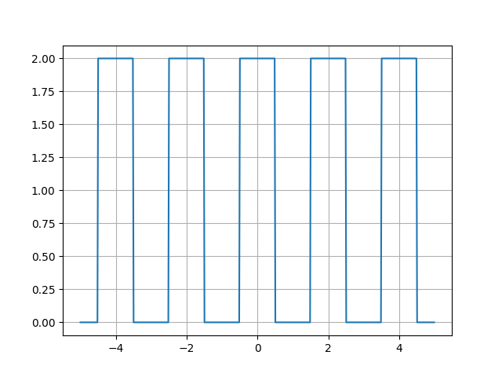

### 1） 利用三角函数/正余弦正交函数集合，对周期信号f(t)进行三角傅里叶级数展开，写出其三角傅里叶级数表达式

$$
a_0=\frac{1}{T}\int^{\frac{T}{2}}_{-\frac{T}{2}}f(t){\rm d}t=\frac{1}{2}\int^1_{-1}f(t){\rm d}t=\frac{1}{2}\int^{\frac{1}{2}}_{-\frac{1}{2}}2{\rm d}t=1
$$

$$
\begin{align}
a_n
&=\frac{2}{T}\int^{\frac{T}{2}}_{-\frac{T}{2}}f(t)\cos n\omega t{\rm d}t\\[2ex]
&=\frac{2}{2}\int^1_{-1}f(t)\cos nωt{\rm d}t \\[2ex]
&=\int^{\frac{1}{2}}_{-\frac{1}{2}}\cosωnt{\rm d}t  \\[2ex]
&=\frac{2}{n\pi}\sin \frac{nω}{2}\\[2ex]
\end{align}
$$

取$ω =\frac{2\pi}{T}=\pi$得

$$
a_n=\frac{2}{n\pi}\sin \frac{n\pi}{2}
$$

$$
b_n=\frac{2}{T}\int^{\frac{T}{2}}_{-\frac{T}{2}}f(t)\sin nω t{\rm d}t=0
$$

故该周期信号利用三角函数的傅里叶展开为

$$
f(t)=1+\sum^\infty_{n=1}\frac{2}{n\pi}\sin\frac{n\pi}{2}cosn\pi t
$$

带入数值：

$$
f(t)=1+\frac{4}{\pi}\cos(\pi t)-\frac{4}{3\pi}\cos(3\pi t)+\frac{4}{5\pi}\cos(5\pi t)-\frac{4}{7\pi}\cos(7\pi t)+\cdots
(前五个非零项)
$$

### 2） 计算前三非零项之和与前五非零项之和

前三项和：

$$
f(t)=1+\frac{4}{\pi}\cos(\pi t)-\frac{4}{3\pi}\cos(3\pi t)
$$

前五项和：

$$
f(t)=1+\frac{4}{\pi}\cos(\pi t)-\frac{4}{3\pi}\cos(3\pi t)+\frac{4}{5\pi}\cos(5\pi t)-\frac{4}{7\pi}\cos(7\pi t)
$$

```python
import numpy as np
import matplotlib.pyplot as plt
import scipy.signal as sgn

def SumOf_firstNitems(n : int, t : np.arange) -> np.arange:
    sum : np.ndarray = np.ones(np.size(t),dtype=complex)
    if (n == 1):
        return sum;
    elif (n > 1):
        n = int( 2 * n - 2 )
        for i in range(1, n):
            sum += (4 * np.sin(np.pi * i / 2) * np.cos(np.pi * i * t) / np.pi / i)
        return sum
    else :
        print("invalid input")

def ex5_2():
    t = np.arange(-7, 7, 0.01)
    y = sgn.square(np.pi * (t + 0.5)) + 1

    # 前3项之和
    # y1 = 1 + 4 * np.cos(np.pi * t) / np.pi - 4 * np.cos(3 * np.pi * t) / np.pi / 3
    y1 = SumOf_firstNitems(3, t)

    # 前5项之和
    # y2 = 1 + 4 * np.cos(np.pi * t) / np.pi - 4 * np.cos(3 * np.pi * t) / np.pi / 3 + 4 * np.cos(5 * np.pi * t) / np.pi / 5 - 2 * np.cos(7 * np.pi *t) / np.pi / 7
    y2 = SumOf_firstNitems(5, t)

    y3 = SumOf_firstNitems(20, t)
    plt.subplot(3, 1, 1)
    plt.plot(t, y)
    plt.plot(t, y1, color = "red")
    plt.ylabel("f(t)")
    plt.legend(["origen", "first 3 items"])
    plt.title("Figure 5.2 : first 3 (and 5) items")

    plt.subplot(3, 1, 2)
    plt.plot(t, y)
    plt.plot(t, y2, color = "red")
    plt.xlabel("t[s]")
    plt.ylabel("f(t)")
    plt.legend(["origen", "first 5 items"])

    plt.subplot(3, 1, 3)
    plt.plot(t, y)
    plt.plot(t, y3, color = "red")
    plt.xlabel("t[s]")
    plt.ylabel("f(t)")
    plt.legend(["origen", "first 20 items"])

    plt.show()

ex5_2()
```
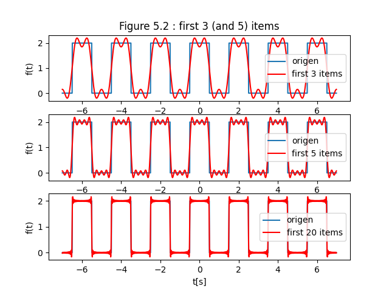

### 3) 写出f(t)的指数傅里叶级数展开

由1)得：

$$
F_0=a_0=\frac{1}{2}\\[2ex] 
F_n=\frac{1}{2}(a_n-jb_n)\\[2ex]
F_{-n}=\frac{1}{2}(a_n+jb_n)\\[2ex]
$$

故：

$$
F_n=F_{-n}=\frac{1}{2}a_n=\frac{2}{n\pi}\sin \frac{n\pi}{2}
$$

$$
\begin{align}
f(t) 
&=\sum^\infty_{n=-\infty}F_ne^{jnω t} \\[2ex] 
&=F_0+\sum^\infty_{n=1}F_ne^{jnω t}+\sum^\infty_{n=1}F_{-n}e^{-jnω t} \\[2ex] 
&=1+\sum^\infty_{n=1}\frac{2}{n\pi}\sin \frac{n\pi}{2}e^{jnω t}+\sum^\infty_{n=1}\frac{2}{n\pi}\sin \frac{n\pi}{2}e^{-jnω t} \\[2ex] 
\end{align}
$$

带入数值即：

$$
f(t)=1+\frac{2}{\pi}e^{j\pi t}+\frac{2}{\pi}e^{-j\pi t}-\frac{2}{3\pi}e^{3j\pi t}-\frac{2}{3\pi}e^{-3j\pi t}+\frac{2}{5\pi}e^{5j\pi t}+\frac{2}{5\pi}e^{-5j\pi t}+\cdots
$$

### 4) 分别计算指数傅里叶级数展开中的前3、5、21项之和

前3项和：

$$
f(t)=1+\frac{2}{\pi}e^{j\pi t}+\frac{2}{\pi}e^{-j\pi t}-\frac{2}{3\pi}e^{3j\pi t}-\frac{2}{3\pi}e^{-3j\pi t}
$$

前5项和：

$$
f(t)=1+\frac{2}{\pi}e^{j\pi t}+\frac{2}{\pi}e^{-j\pi t}-\frac{2}{3\pi}e^{3j\pi t}-\frac{2}{3\pi}e^{-3j\pi t}+\frac{2}{5\pi}e^{5j\pi t}+\frac{2}{5\pi}e^{-5j\pi t}
$$

前21项和：

$$
\begin{align}
f(t) =1+\sum^{10}_{n=1}\frac{2}{n\pi}\sin \frac{n\pi}{2}e^{jnω t}+\sum^{10}_{n=1}\frac{2}{n\pi}\sin \frac{n\pi}{2}e^{-jnω t} \\[2ex] 
\end{align}
$$


```python
import numpy as np
import matplotlib.pyplot as plt
import scipy.signal as sgn

def sumOf_firstNitems(n : int , t : np.arange) -> np.arange:
    sum : np.ndarray = np.ones(np.size(t),dtype=complex)

    if n == 1:
        return sum
    elif n > 1:
        n = int(n / 2) + 1
        flag : int = 1
        for i in range(1, n):
            sum += flag * 2.0 * (np.exp(1j * np.pi * t * (2 * i - 1)) + np.exp(-1j * np.pi * t * (2 * i - 1))) / (np.pi * (2 * i - 1))
            flag = -flag
        return sum
    
    else:
        print("invalid input！")

def ex5_3():
    t = np.arange(-7, 7, 0.01)
    y = sgn.square(np.pi * (t + 0.5)) + 1

    # 前3项和
    # y3 = 1 + np.exp(1j * np.pi * t) * 2 / np.pi + np.exp(-1j * np.pi * t) * 2 / np.pi
    y3 = sumOf_firstNitems(3, t)

    # 前5项和
    # y5 = 1 + np.exp(1j * np.pi * t) * 2 / np.pi + np.exp(-1j * np.pi * t) * 2 / np.pi - np.exp(3j * np.pi * t) * 2 / np.pi / 3 - np.exp(-3j * np.pi * t) * 2 / np.pi / 3
    y5 = sumOf_firstNitems(5, t)

    # 前21项和
    y21 = sumOf_firstNitems(21, t)


    plt.subplot(3, 1, 1)
    plt.plot(t, y)
    plt.plot(t, y3.real, color = 'red')
    plt.ylabel("f(t)")
    plt.legend(["origen", "first 3 items"])
    plt.subplot(3, 1, 2)

    plt.plot(t, y)
    plt.plot(t, y5.real, color = 'red')
    plt.ylabel("f(t))")
    plt.legend(["origen", "first 5 items"])
    plt.subplot(3, 1, 3)

    plt.plot(t, y)
    plt.plot(t, y21.real, color = 'red')
    plt.xlabel("t[s]")
    plt.ylabel("f(t))")
    plt.legend(["origen", "first 21 items"])
    plt.show()

ex5_3()
```


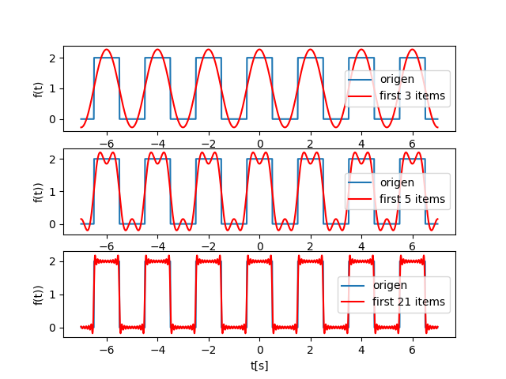

# 实验体会和感悟

#### 实验一的内容并不复杂，主要是对课堂上讲到的基本内容的练习、应用、复现，也是为了让我们熟悉Matlab或者Python绘图。再加之老师、助教在实验前为我们讲解了具体的实验过程以及一些注意事项，我自己在之前的学习中也有使用过Python三剑客进行数据处理和可视化，因此总体而言实验进行地并不算困难。在实验过程中我也遇到了一些小问题，除了公式推导出错以外，还有一些matplotlib版本导致函数使用变更的问题，不过好在通过官方文档顺利解决，推导计算也在检查之后更正。这次实验之后，我对卷积运算的熟悉程度进一步加深，对傅里叶级数三角形式以及指数形式的展开与转换的理解也更加深入，对Python数据处理工具的使用也更加得心应手，这些都让我的基础更加牢固，为以后的学习打下基础。

<br />
<br />
<br />
<br />


